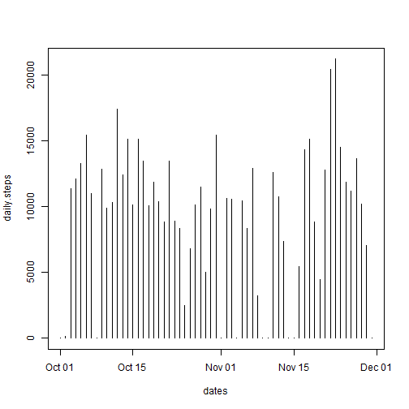
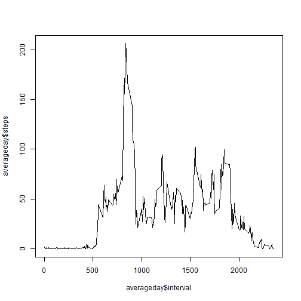
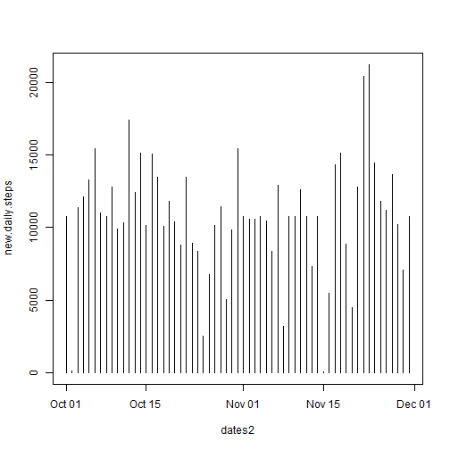

#Peer Assesment 1

##Loading and Preprocessing the data


```r
activity <- read.csv("./activity.csv")
```

##What is the mean total number of steps taken per day?


```r
daily.steps <- tapply(activity$steps, activity$date, FUN = sum, na.rm = TRUE)
datestemp <- activity$date
datestemp2 <- levels(datestemp)
dates <- as.Date(datestemp2)
table <- cbind(dates, daily.steps)
table
```

```
##            dates daily.steps
## 2012-10-01 15614           0
## 2012-10-02 15615         126
## 2012-10-03 15616       11352
## 2012-10-04 15617       12116
## 2012-10-05 15618       13294
## 2012-10-06 15619       15420
## 2012-10-07 15620       11015
## 2012-10-08 15621           0
## 2012-10-09 15622       12811
## 2012-10-10 15623        9900
## 2012-10-11 15624       10304
## 2012-10-12 15625       17382
## 2012-10-13 15626       12426
## 2012-10-14 15627       15098
## 2012-10-15 15628       10139
## 2012-10-16 15629       15084
## 2012-10-17 15630       13452
## 2012-10-18 15631       10056
## 2012-10-19 15632       11829
## 2012-10-20 15633       10395
## 2012-10-21 15634        8821
## 2012-10-22 15635       13460
## 2012-10-23 15636        8918
## 2012-10-24 15637        8355
## 2012-10-25 15638        2492
## 2012-10-26 15639        6778
## 2012-10-27 15640       10119
## 2012-10-28 15641       11458
## 2012-10-29 15642        5018
## 2012-10-30 15643        9819
## 2012-10-31 15644       15414
## 2012-11-01 15645           0
## 2012-11-02 15646       10600
## 2012-11-03 15647       10571
## 2012-11-04 15648           0
## 2012-11-05 15649       10439
## 2012-11-06 15650        8334
## 2012-11-07 15651       12883
## 2012-11-08 15652        3219
## 2012-11-09 15653           0
## 2012-11-10 15654           0
## 2012-11-11 15655       12608
## 2012-11-12 15656       10765
## 2012-11-13 15657        7336
## 2012-11-14 15658           0
## 2012-11-15 15659          41
## 2012-11-16 15660        5441
## 2012-11-17 15661       14339
## 2012-11-18 15662       15110
## 2012-11-19 15663        8841
## 2012-11-20 15664        4472
## 2012-11-21 15665       12787
## 2012-11-22 15666       20427
## 2012-11-23 15667       21194
## 2012-11-24 15668       14478
## 2012-11-25 15669       11834
## 2012-11-26 15670       11162
## 2012-11-27 15671       13646
## 2012-11-28 15672       10183
## 2012-11-29 15673        7047
## 2012-11-30 15674           0
```

```r
plot(x = dates, y = daily.steps, type = "h")
```

 

```r
mean(daily.steps)
```

```
## [1] 9354.23
```

```r
median(daily.steps)
```

```
## [1] 10395
```

##What is the averaacge daily activity pattern?


```r
averageday <- aggregate.data.frame(x = list(steps = activity$steps), by = list(interval = activity$interval), FUN = mean, na.rm = TRUE)
plot(x = averageday$interval, y = averageday$steps, type = "l")
```

 

```r
averageday[which.max(averageday$steps),]
```

```
##     interval    steps
## 104      835 206.1698
```

##Imputing Missing Values


```r
nummberofnastemp <- is.na(activity)
numberofnas <- sum(nummberofnastemp)
imput.missing.data <- function(steps, interval) {
  datapiece <- 0
  if (!is.na(steps)) {
      datapiece <- c(steps)
      }
  else {
      datapiece <- averageday[averageday$interval == interval, "steps"]
  }
}
edited.activity <- activity
edited.activity$steps <- mapply(imput.missing.data, edited.activity$steps, edited.activity$interval)

new.daily.steps <- tapply(edited.activity$steps, edited.activity$date, FUN = sum, na.rm = TRUE)
datestemp3 <- edited.activity$date
datestemp4 <- levels(datestemp3)
dates2 <- as.Date(datestemp4)
plot(x = dates2, y = new.daily.steps, type = "h")
```

 

```r
mean(new.daily.steps)
```

```
## [1] 10766.19
```

```r
median(new.daily.steps)
```

```
## [1] 10766.19
```
The values are higher as previously the NAs were set to 0 but now they are not. This leads to a higher mean and median as they are taking averages of a the same list but with all the smallest values significantly increased. 

##Are there differences in activity patterns between weekdays and weekends?


```r
weekdayfunction <- function(date) {  
if(weekdays(date) %in% c("Monday", "Tuesday", "Wednesday", "Thursday", "Friday")) {
    return("Weekday")
  }
  else if(weekdays(date) %in% c("Saturday", "Sunday")) {
    return("Weekend")
 }
  else {
    print("error in finding weekday")
  }}
edited.activity$date <- as.Date(edited.activity$date)
edited.activity$weekday <- sapply(edited.activity$date, FUN = weekdayfunction)
daily.steps2 <- tapply(edited.activity$steps, edited.activity$date, FUN = sum, na.rm = TRUE)
##averageweekday <- aggregate(edited.activity, FUN = mean, x = edited.activity$steps, by = list(edited.activity$Weekday) + list(edited.activity$intervals))
```
